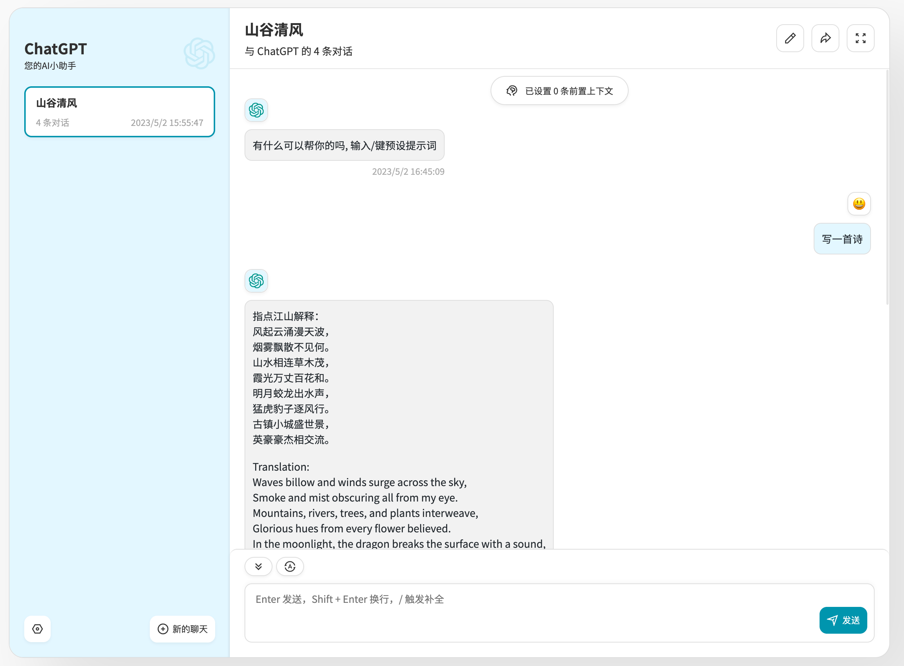

<h1 align="center">ChatGPT AI-ROCKET</h1>

- 此项目主要是用来展示如何通过AI小火箭：https://rocket.ai.cc 提供的接口代理能力快速部署一个ChatGPT聊天网站。
- 使用我们提供的API代理能力，您可以不用处理ChatGPT的限制国内访问，完全可以本地构建一个代理聊天程序，您也可以部署在任何server端，甚至于公司内部聊天机器人，小程序，APP等等。
- 执行 `yarn install && yarn dev` 即可。
- 本地访问http://localhost:3000/?api_key=API_KEY
- API_KEY从 "[控制台](https://account.ai-rocket.cc/)-个人信息" 获取。

- 此源码来自于 https://github.com/Yidadaa/ChatGPT-Next-Web ，如有侵权，请私信我们立即删除

